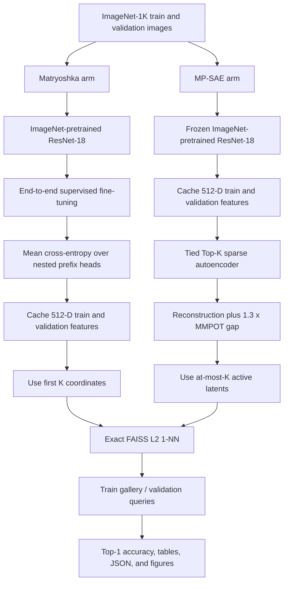

# ImageNet Representation-Budget Experiment

## Matryoshka backbones versus MP-SAE with Multimarginal Partial Optimal Transport

**Implementation:** [`csr_vs_mmpot_imagenet.py`](./csr_vs_mmpot_imagenet.py)  
**Dataset:** ImageNet-1K  
**Primary metric:** exact Euclidean 1-nearest-neighbor top-1 accuracy on the validation split  
**Document scope:** code-grounded design and implementation reference  
**Reviewed:** 2026-09-08

> **Architecture ablation.** The launcher uses ResNet-18 and ResNet-50 as its
> default controlled backbone pair. All non-architectural training and
> evaluation settings are shared, and aggregation fails if they differ.
> Both ResNets use torchvision's `IMAGENET1K_V1` pretrained-weight recipe.
> Swin-T remains available as an optional extension via `--backbone`.
> Backbone feature dimensions are 512, 2,048, and 768 respectively, and the
> default MP-SAE width remains `h = 4d`.

---

## 1. Executive summary

The experiment asks whether two forms of budget-adjustable ImageNet representation retain class-neighborhood structure at small budgets:

1. **Matryoshka** learns a dense backbone feature vector end to end, with classification heads attached to nested prefixes of that vector. At evaluation budget \(K\), only the first \(K\) coordinates are used.
2. **MP-SAE** keeps the same ImageNet-pretrained backbone frozen and learns a tied Top-\(K\) sparse autoencoder over its features. Its \(K\), \(2K\), and \(4K\) codes are regularized as three aligned views using a multimarginal partial optimal-transport optimality gap. At evaluation budget \(K\), the code has at most \(K\) positive nonzero latents.

Both representations are evaluated by the same label-transfer rule: the ImageNet training split is the gallery, the validation split supplies queries, and an exact FAISS `IndexFlatL2` search transfers the label of the single nearest gallery item. The reported value is validation top-1 accuracy in percent.

The architecture ablation repeats this complete comparison for ResNet-18 and
ResNet-50. Its effect estimate is the within-backbone difference
`MP-SAE top-1 - Matryoshka top-1` at each representation budget; the aggregate
report then measures how stable that effect is across the two backbones.

The MP-SAE training objective is

\[
\mathcal{L}_{\text{MP-SAE}}
=
\mathcal{L}_{\text{reconstruction}}
+ 1.3\,\mathcal{G}_{\text{MMPOT}},
\]

where the coefficient **1.3 is hard-coded**, not exposed as a command-line option.

> **Naming note.** Despite the historical filename `csr_vs_mmpot_imagenet.py`, the implementation contains no method, class, loss, or result key named `CSR`. Its canonical comparison is `matryoshka` versus `mpsae`. This document follows the implemented terminology and treats the filename as a legacy experiment identifier.

---

## 2. Research idea

### 2.1 Motivation

A conventional embedding has a fixed dimensionality and usually must be retrained or projected when a smaller representation is required. This experiment compares two alternatives that expose several operating points from one trained model:

- **Nested dense representations:** organize useful information early in the coordinate order, making every requested prefix directly usable.
- **Nested sparse representations:** use a larger latent dictionary but activate only a small number of entries, allowing the activity budget to change after training.

The MMPOT term adds a consistency principle to the sparse arm. The Top-\(K\), Top-\(2K\), and Top-\(4K\) encodings of the same frozen backbone feature should form a preferred diagonal matching across views. The regularizer compares that reference matching with the best entropy-regularized partial multimarginal coupling. If a cheaper cross-sample coupling exists, the gap penalizes the representation.

### 2.2 Operational hypothesis

For each requested budget \(K \in \{8,16,32,64,128,256\}\) by default, compare:

\[
\text{MRL representation}=r_{1:K}
\qquad\text{against}\qquad
\text{MP-SAE representation}=z_K.
\]

The experiment measures whether MP-SAE improves exact 1-NN top-1 accuracy relative to the Matryoshka prefix:

\[
\Delta_K
=
\operatorname{Acc}_{\text{MP-SAE},K}
-
\operatorname{Acc}_{\text{Matryoshka},K},
\]

reported in percentage points.

### 2.3 What the experiment does not establish

The code is an empirical comparison, not a proof that the two arms have identical training information, storage cost, or compute. In particular:

- Matryoshka is fine-tuned end to end with ImageNet labels; MP-SAE is trained without labels on frozen features, although those features come from a supervised ImageNet-pretrained ResNet-18.
- A Matryoshka budget of \(K\) is a dense vector of dimension \(K\). An MP-SAE budget of \(K\) is an at-most-\(K\)-sparse vector whose ambient dimension is `hidden_dim` (2,048 by default).
- FAISS stores the MP-SAE vectors densely, so the current implementation does not realize sparse storage or sparse distance-computation savings.
- The script runs one seed and does not compute uncertainty, confidence intervals, or significance tests.

These are interpretation constraints rather than execution errors.

---

## 3. Experimental construction



### 3.1 Common backbone initialization

Both arms begin with torchvision's `ResNet18_Weights.IMAGENET1K_V1`. The final fully connected layer is replaced by `nn.Identity()`, exposing the 512-dimensional penultimate feature vector.

The weight cache path is assigned to `TORCH_HOME`, so torchvision downloads the official checkpoint once and reuses it. A run therefore needs either network access on first use or a populated local weight cache.

### 3.2 Matryoshka arm

The Matryoshka model contains:

- a trainable ResNet-18 feature extractor;
- one linear 1,000-class head for every requested prefix dimension; and
- an additional head for the full 512-dimensional representation.

If the requested dimensions are \(\mathcal{D}\), the actual head set is

\[
\widetilde{\mathcal{D}}
=
\operatorname{unique}(\mathcal{D}\cup\{512\}).
\]

For an image \(x\), feature vector \(r=f_\theta(x)\), target \(y\), and dimension-specific head \(g_d\), the training loss is

\[
\mathcal{L}_{\text{MRL}}
=
\frac{1}{|\widetilde{\mathcal{D}}|}
\sum_{d\in\widetilde{\mathcal{D}}}
\operatorname{CE}\!\left(g_d(r_{1:d}),y\right).
\]

All heads receive equal weight. The model is optimized with SGD, momentum, weight decay, and a cosine-annealed learning rate. Training uses random resized crops and horizontal flips; feature caching uses the deterministic pretrained ResNet-18 evaluation transform.

The classification heads are training devices only. The benchmark discards them and uses the learned feature prefixes directly.

### 3.3 Frozen-feature MP-SAE arm

The second arm freezes the pretrained ResNet-18 and first writes its deterministic 512-dimensional train and validation features to float16 NumPy memory maps. The sparse autoencoder reads those cached features as float32 tensors.

Let:

- \(r\in\mathbb{R}^{512}\) be a frozen backbone feature;
- \(h\) be the latent dimension, 2,048 by default;
- \(D\in\mathbb{R}^{h\times512}\) be the learned decoder dictionary;
- \(b_{\text{pre}}\in\mathbb{R}^{512}\) be the input centering bias; and
- \(b_{\text{enc}}\in\mathbb{R}^{h}\) be the encoder bias.

The tied encoder preactivation is

\[
a(r)=(r-b_{\text{pre}})D^\top+b_{\text{enc}}.
\]

For budget \(K\), the encoder retains the \(K\) largest preactivations and applies ReLU:

\[
z_K=T_K(a)=\operatorname{ReLU}\!\left(\operatorname{TopK}(a,K)\right).
\]

Because ReLU is applied after selection, negative selected values become zero. Consequently, the implementation produces **at most \(K\)** positive nonzeros, not necessarily exactly \(K\).

The tied decoder is

\[
\widehat r_K=z_KD+b_{\text{pre}}.
\]

Decoder rows are normalized after every optimizer step. The decoder is initialized with Kaiming-uniform values and row-normalized; `pre_bias` is initialized to the mean of the first at most 100,000 cached training features.

### 3.4 Nested reconstruction objective

Training constructs three views from the same preactivation vector:

\[
z_K,\qquad z_{2K},\qquad z_{4K},
\]

where \(K\) is `train_k` (32 by default), independently of the list of evaluation budgets.

The main and nested reconstruction terms are

\[
\mathcal{L}_{K}=\operatorname{MSE}(\widehat r_K,r),
\]

\[
\mathcal{L}_{\text{nested}}
=
\frac{1}{2}\left[
\operatorname{MSE}(\widehat r_{2K},r)
+
\operatorname{MSE}(\widehat r_{4K},r)
\right].
\]

The class tracks how many optimizer steps each latent has remained inactive under \(z_K\). Once a latent has been inactive for at least `dead_steps`, an auxiliary Top-\(K_{aux}\) code over dead latents attempts to reconstruct the detached residual \(r-\widehat r_K\). This produces \(\mathcal{L}_{\text{aux}}\), or zero when no eligible dead latents exist.

The autoencoder reconstruction objective is

\[
\mathcal{L}_{\text{reconstruction}}
=
\mathcal{L}_K
+ \alpha_{\text{multi}}\mathcal{L}_{\text{nested}}
+ \alpha_{\text{aux}}\mathcal{L}_{\text{aux}},
\]

with defaults

\[
\alpha_{\text{multi}}=\frac18,
\qquad
\alpha_{\text{aux}}=\frac1{32}.
\]

### 3.5 Three-view circular-variance cost

The MMPOT term receives \(z_K,z_{2K},z_{4K}\). Each view is row-normalized before its pairwise cosine distances are calculated. For samples \(i,j,k\) drawn from the three views, the code constructs

\[
C_{ijk}
=
\frac{2}{9}
\left[
(1-\langle \bar z_{K,i},\bar z_{2K,j}\rangle)
+
(1-\langle \bar z_{K,i},\bar z_{4K,k}\rangle)
+
(1-\langle \bar z_{2K,j},\bar z_{4K,k}\rangle)
\right],
\]

then clamps the result to \([0,1]\). The full cost tensor for an OT group of size \(B\) has shape \(B\times B\times B\), which motivates the separate `ot_microbatch` setting.

### 3.6 Partial multimarginal matching gap

For an OT microbatch of \(n\) samples, every marginal target is uniform:

\[
p_i=\frac1n.
\]

The partial transport mass is \(s\), configured by `ot_mass`. Conceptually, the feasible coupling \(X\ge0\) transports total mass \(s\), each marginal is bounded by \(p\), and the unused marginal mass is represented by nonnegative slack vectors.

The code uses the sample-aligned diagonal partial matching as its reference:

\[
X^{\text{ref}}_{iii}=\frac{s}{n},
\qquad
X^{\text{ref}}_{ijk}=0\ \text{otherwise},
\]

with reference slack \((1-s)p\) for each of the three marginals.

Define

\[
H(u)=\sum_{u_\ell>0}u_\ell(\log u_\ell-1).
\]

The entropy-regularized partial OT objective represented by the implementation is

\[
F_C(X,q_1,q_2,q_3)
=
\langle C,X\rangle
+\eta\left[H(X)+\sum_{m=1}^{3}H(q_m)\right].
\]

The greedy scaling solver returns an approximate optimum \((X^*,q_1^*,q_2^*,q_3^*)\), and the regularizer is the reference optimality gap

\[
\mathcal{G}_{\text{MMPOT}}
=
F_C(X^{\text{ref}},q^{\text{ref}})
-
F_C(X^*,q^*).
\]

The transport plan is solved under `torch.no_grad()`. The loss then uses envelope/Danskin differentiation: its numerical value includes the detached entropy terms, while its gradient through the cost is equivalent to

\[
\frac{\partial \mathcal{G}}{\partial C}
=
X^{\text{ref}}-X^*.
\]

This avoids differentiating through all Greenkhorn iterations.

### 3.7 Greenkhorn-style solver

`greenkhorn_mmpot` forms the Gibbs kernel

\[
K=\exp(-C/\eta)
\]

and maintains three marginal scaling vectors plus a scalar mass scale. At every iteration it:

1. constructs the scaled three-way kernel;
2. estimates the three marginal-plus-slack constraints and total transported mass;
3. evaluates generalized KL constraint violations;
4. greedily updates the single worst constraint; and
5. stops when the maximum violation is no larger than `ot_tol` or `ot_iters` is reached.

Returned diagnostics include transported mass, mass error, marginal-cap violation, final constraint error, and iteration count. The epoch history retains only the averaged mass error.

### 3.8 Complete MP-SAE loss

The optimizer minimizes

\[
\boxed{
\mathcal{L}_{\text{MP-SAE}}
=
\mathcal{L}_{K}
+\frac18\mathcal{L}_{\text{nested}}
+\frac1{32}\mathcal{L}_{\text{aux}}
+1.3\mathcal{G}_{\text{MMPOT}}
}
\]

using Adam with no learning-rate scheduler. The numerically sensitive OT path is forced to float32 even when automatic mixed precision is enabled for the surrounding forward pass.

---

## 4. End-to-end execution flow

The `main` function performs the following sequence.

### 4.1 Initialization

1. Parse and validate arguments.
2. Resolve dataset, cache, output, and weight paths to absolute paths.
3. Create the output directory.
4. Seed Python, NumPy, and PyTorch.
5. Resolve `--device auto` to CUDA when available, otherwise CPU.

### 4.2 Matryoshka branch

When `--method matryoshka` or `--method both` is selected:

1. Re-seed the process.
2. Fine-tune ResNet-18 with the mean nested cross-entropy loss.
3. Save a checkpoint and JSON history after every epoch.
4. Re-encode the selected ImageNet train and validation samples with deterministic evaluation preprocessing.
5. Cache 512-dimensional features and labels.
6. Benchmark every requested prefix dimension with exact 1-NN.
7. Save method-specific results.

### 4.3 MP-SAE branch

When `--method mpsae` or `--method both` is selected:

1. Load and freeze the pretrained ResNet-18.
2. Cache its deterministic train and validation features unless a complete cache triplet already exists or `--rebuild-cache` is supplied.
3. Initialize the Top-\(K\) sparse autoencoder and center bias.
4. Train with reconstruction, dead-latent auxiliary, and MMPOT gap terms.
5. Save a checkpoint and JSON history after every epoch.
6. Encode gallery and query features at every requested activity budget.
7. Benchmark exact 1-NN and save method-specific results.

### 4.4 Aggregation

The script writes a complete `summary.json`. If both methods ran, it also creates comparison rows, Markdown/CSV/LaTeX tables, a publication comparison figure, and training-diagnostic plots.

---

## 5. Exact evaluation protocol

For each method and budget \(K\):

1. Build a fresh `faiss.IndexFlatL2` index.
2. Encode every selected training example and add it to the index.
3. Encode each selected validation example.
4. Retrieve exactly one nearest training example.
5. Predict its ImageNet class label.
6. Report the percentage of validation queries with the correct transferred label.

The representations are:

| Arm | FAISS vector | Index dimension | Nominal budget |
|---|---|---:|---:|
| Matryoshka | first \(K\) backbone-feature coordinates | \(K\) | dense prefix dimension \(K\) |
| MP-SAE | full sparse latent vector \(z_K\) | `hidden_dim` | at most \(K\) positive entries |

By default, vectors are **not L2-normalized** before indexing. Passing `--knn-normalize` normalizes both gallery and queries. FAISS `IndexFlatL2` reports squared Euclidean distance, which the result schema names `mean_neighbor_l2_squared`.

The nearest-neighbor distance should not be compared casually across budgets or arms: the dimensionalities, coordinate systems, scales, and sparsity patterns differ, especially when normalization is disabled. Top-1 label-transfer accuracy is the primary cross-arm metric.

---

## 6. Data handling and reproducibility

### 6.1 Supported backends

#### ImageFolder

The default backend expects:

```text
/path/to/imagenet/
├── train/
│   ├── n01440764/
│   └── ...
└── val/
    ├── n01440764/
    └── ...
```

Each split is loaded with `torchvision.datasets.ImageFolder`.

#### Hugging Face

With `--data-backend hf`, the code loads `ILSVRC/imagenet-1k` by default and maps the local `val` role to the dataset's `validation` split. Authentication is taken from the environment variable named by `--hf-token-env`; if it is absent, the datasets client is asked to use its cached login.

### 6.2 Deterministic subsets

`--max-train` and `--max-val` select deterministic random subsets with `torch.randperm`:

- training subset seed: `seed`;
- validation subset seed: `seed + 1`;
- value `0`: use the full split.

Within a backend, both experiment arms therefore select the same sample indices. Selection is random rather than class-stratified.

### 6.3 Feature caches

Each cache consists of:

- `{split}_features.f16.npy`: shape \([N,512]\), float16;
- `{split}_labels.npy`: shape \([N]\), int64; and
- `{split}_meta.json`: basic provenance and timing.

Both feature branches validate cache metadata, array shape, dtype, sample count, dataset revision, subset settings, and backbone before reuse. The Matryoshka cache is additionally tied to the fine-tuned checkpoint's size and modification timestamp. `--rebuild-cache` forces both branches to recompute.

### 6.4 Approximate storage formulas

For \(N\) examples, one feature cache requires approximately

\[
2N(512)+8N\ \text{bytes},
\]

excluding NumPy headers and metadata. The two arms use separate caches.

During FAISS evaluation, the current dense index requires approximately:

\[
4NK\ \text{bytes for Matryoshka},
\qquad
4Nh\ \text{bytes for MP-SAE},
\]

where \(h\) is `hidden_dim`. Thus the MP-SAE index memory does not shrink with \(K\) in this implementation.

---

## 7. Command-line configuration

The following defaults come directly from `build_parser` in the experiment script.

### 7.1 Dataset and cache arguments

| Argument | Default | Purpose |
|---|---:|---|
| `--data-root` | required | ImageFolder root or Hugging Face cache directory |
| `--data-backend` | `imagefolder` | `imagefolder` or `hf` |
| `--hf-dataset-id` | `ILSVRC/imagenet-1k` | Hugging Face dataset identifier |
| `--hf-revision` | `main` | Dataset revision |
| `--hf-token-env` | `HF_TOKEN` | Environment variable holding the access token |
| `--cache-dir` | `runs/matryoshka_mpsae/cache` | Frozen and fine-tuned Matryoshka feature caches |
| `--weights-cache` | `weights` | Local `TORCH_HOME` for pretrained weights |
| `--rebuild-cache` | off | Recompute both train/validation feature-cache branches |
| `--feature-batch-size` | `512` | Image-to-feature inference batch size |
| `--workers` | `8` | DataLoader workers |
| `--prefetch-factor` | `2` | Batches prefetched by each worker |
| `--max-train` | `0` | Maximum training examples; `0` means all |
| `--max-val` | `0` | Maximum validation examples; `0` means all |

### 7.2 Sparse-autoencoder arguments

| Argument | Default | Purpose |
|---|---:|---|
| `--hidden-dim` | `2048` | Ambient sparse latent dimension |
| `--topk` | `8,16,32,64,128,256` | Evaluation budgets and Matryoshka prefix heads |
| `--train-k` | `32` | Base sparse budget used to form \(K,2K,4K\) training views |
| `--k-aux` | `512` | Maximum auxiliary dead-latent budget |
| `--aux-weight` | `1/32` | Dead-latent auxiliary-loss weight |
| `--dead-steps` | `1000` | Inactive steps before a latent is considered dead |
| `--multi-topk-weight` | `1/8` | Nested \(2K/4K\) reconstruction weight |

`hidden_dim` must be at least both the largest evaluation budget and \(4\times\text{train_k}\). Matryoshka prefix dimensions cannot exceed 512.

### 7.3 Training and OT arguments

| Argument | Default | Purpose |
|---|---:|---|
| `--method` | `both` | `matryoshka`, `mpsae`, or `both` |
| `--epochs` | `10` | Epochs for each selected arm |
| `--batch-size` | `1024` | Training batch size |
| `--lr` | `4e-5` | MP-SAE Adam learning rate |
| `--weight-decay` | `1e-4` | Weight decay for both optimizers |
| `--mrl-lr` | `1e-2` | Matryoshka SGD learning rate |
| `--mrl-momentum` | `0.9` | Matryoshka SGD momentum |
| `--ot-mass` | `0.8` | Partial transport mass \(s\) |
| `--ot-eta` | `0.2` | Entropic regularization \(\eta\) |
| `--ot-iters` | `100` | Maximum Greenkhorn iterations |
| `--ot-tol` | `1e-4` | Maximum accepted constraint error |
| `--ot-microbatch` | `32` | Samples per cubic MMPOT cost tensor |
| `--amp` / `--no-amp` | enabled | CUDA automatic mixed precision |
| `--device` | `auto` | PyTorch device |
| `--seed` | `42` | Random seed |
| `--print-freq` | `50` | Training log interval in steps |
| `--resume` | off | Resume each selected arm from its `last.pt` |
| `--output-dir` | `runs/matryoshka_mpsae` | Checkpoints, metrics, tables, and plots |

The MMPOT loss weight is not listed because it is the source constant `MMPOT_LOSS_WEIGHT = 1.3`.

> `run_all_experiments_docker.sh` overrides the Python default and passes `--ot-mass 0.9` unless `CSR_OT_MASS` is changed. Always use `summary.json` as the record of the configuration that actually ran.

### 7.4 FAISS arguments

| Argument | Default | Purpose |
|---|---:|---|
| `--knn-batch-size` | `4096` | Gallery encoding/addition batch size |
| `--knn-query-batch` | `4096` | Query encoding/search batch size |
| `--knn-normalize` / `--no-knn-normalize` | disabled | L2-normalize representations before search |
| `--faiss-gpu` / `--no-faiss-gpu` | enabled | Use GPU or CPU FAISS |
| `--faiss-gpu-device` | model GPU or `0` | GPU used for FAISS |
| `--faiss-temp-memory-mib` | `512` | Temporary GPU memory reserved by FAISS |

GPU FAISS is the program default even when `--device auto` resolves to CPU. Explicitly pass `--no-faiss-gpu` for a CPU-only run.

---

## 8. Running the experiment

### 8.1 Lightweight development run

This exercises both branches on deterministic subsets and uses CPU FAISS:

```bash
python csr_vs_mmpot_imagenet.py \
  --data-root /path/to/imagenet \
  --data-backend imagefolder \
  --cache-dir runs/dev/cache \
  --output-dir runs/dev \
  --max-train 50000 \
  --max-val 10000 \
  --epochs 3 \
  --batch-size 256 \
  --feature-batch-size 256 \
  --no-faiss-gpu
```

PowerShell equivalent:

```powershell
python .\csr_vs_mmpot_imagenet.py `
  --data-root 'D:\datasets\imagenet' `
  --data-backend imagefolder `
  --cache-dir .\runs\dev\cache `
  --output-dir .\runs\dev `
  --max-train 50000 `
  --max-val 10000 `
  --epochs 3 `
  --batch-size 256 `
  --feature-batch-size 256 `
  --no-faiss-gpu
```

### 8.2 Full-data GPU run

```bash
python csr_vs_mmpot_imagenet.py \
  --data-root /path/to/imagenet \
  --cache-dir /fastssd/imagenet_rn18 \
  --output-dir runs/matryoshka_mpsae \
  --epochs 10 \
  --batch-size 4096 \
  --hidden-dim 2048 \
  --topk 8,16,32,64,128,256 \
  --amp \
  --faiss-gpu
```

The feasible batch size depends on GPU memory. The OT cost is cubic in `ot_microbatch`, not in the full training batch, but the full batch still controls the ResNet or SAE forward/backward memory footprint.

### 8.3 Hugging Face cached dataset

After accepting access conditions for the gated dataset and preparing the cache:

```bash
export HF_TOKEN=hf_your_read_only_token
python csr_vs_mmpot_imagenet.py \
  --data-root /data/huggingface \
  --data-backend hf \
  --output-dir runs/hf_imagenet \
  --cache-dir runs/hf_imagenet/frozen_cache
```

Do not place tokens in commands committed to version control. The repository includes `download_imagenet.py` and `run_imagenet_download.sh` for persistent cache preparation.

### 8.4 Repository launchers

For an existing ImageFolder dataset:

```bash
FAISS_GPU=0 ./run_csr_vs_mmpot_imagenet.sh /path/to/imagenet
```

For the provided Docker/NVIDIA workflow:

```bash
docker build -f Dockerfile.all-experiments -t graduate-thesis-all-experiments:latest .
IMAGE_NAME=graduate-thesis-all-experiments:latest ./run_imagenet_download.sh start
bash run_all_experiments_docker.sh
```

The full launcher requires Docker, an NVIDIA GPU, NVIDIA Container Toolkit, and CUDA-enabled FAISS.

### 8.5 Running only one arm

```bash
python csr_vs_mmpot_imagenet.py --data-root /path/to/imagenet --method matryoshka
python csr_vs_mmpot_imagenet.py --data-root /path/to/imagenet --method mpsae
```

A single-arm run produces its own checkpoint, history, result JSON, and the global summary. Cross-method tables and comparison plots are emitted only when both arms are present in the same invocation.

---

## 9. Output artifacts

With the default output and cache paths, a two-arm run has the following logical structure:

```text
runs/matryoshka_mpsae/
├── cache/                              # frozen ResNet-18 cache
│   ├── train_features.f16.npy
│   ├── train_labels.npy
│   ├── train_meta.json
│   ├── val_features.f16.npy
│   ├── val_labels.npy
│   └── val_meta.json
├── matryoshka/
│   ├── last.pt
│   ├── history.json
│   ├── results.json
│   └── feature_cache/
│       ├── train_features.f16.npy
│       ├── train_labels.npy
│       ├── train_meta.json
│       ├── val_features.f16.npy
│       ├── val_labels.npy
│       └── val_meta.json
├── mpsae/
│   ├── last.pt
│   ├── history.json
│   └── results.json
├── summary.json
├── comparison.csv
├── comparison_table.md
├── comparison_table.tex
├── csr_<backbone>_representation_accuracy_comparison.{pdf,png}
├── csr_<backbone>_training_loss_curves.{pdf,png}
├── csr_<backbone>_training_procedure_overview.{pdf,png}
├── csr_<backbone>_loss_component_impact.{csv,json,pdf,png}
└── csr_<backbone>_training_loss_history.csv
```

### 9.1 Checkpoints

Each `last.pt` contains:

- model state;
- optimizer state;
- zero-based completed epoch;
- accumulated history; and
- parsed arguments.

The Matryoshka checkpoint also stores the cosine scheduler state and nested dimensions.

### 9.2 Histories

Matryoshka history records mean nested classification loss, current learning rate, and epoch duration.

MP-SAE history records:

- total objective;
- the aggregate reconstruction objective, including its weighted nested and auxiliary terms;
- unweighted MMPOT regularizer;
- dead-latent fraction;
- mean OT mass error; and
- epoch duration.

### 9.3 Results

Each method result contains the training protocol, history, and per-budget 1-NN results. `summary.json` adds the resolved configuration, dataset/cache metadata, method labels, and comparison protocol.

The generated comparison table uses:

| Budget \(K\) | Matryoshka top-1 | MP-SAE top-1 | MP-SAE minus Matryoshka |
|---:|---:|---:|---:|
| each requested budget | percent | percent | percentage points |
| **Mean** | unweighted mean across budgets | unweighted mean across budgets | difference of means |

The mean is an across-budget summary, not an aggregate across validation examples with a new prediction rule.

---

## 10. Implementation map

| Source region | Responsibility |
|---|---|
| [`build_parser`](./csr_vs_mmpot_imagenet.py#L92) and [`validate_args`](./csr_vs_mmpot_imagenet.py#L155) | CLI, defaults, and basic configuration checks |
| [`FrozenBackbone`](./csr_vs_mmpot_imagenet.py) | frozen pretrained ResNet-18, ResNet-50, or Swin-T feature backbone |
| [`MatryoshkaBackbone`](./csr_vs_mmpot_imagenet.py) | selected trainable backbone, nested heads, and mean MRL loss |
| [`build_image_dataset`](./csr_vs_mmpot_imagenet.py#L287) | ImageFolder/Hugging Face backend adapter |
| [`cache_split`](./csr_vs_mmpot_imagenet.py#L324) | frozen feature extraction and memory-mapped cache |
| [`TopKSAE`](./csr_vs_mmpot_imagenet.py#L405) | tied sparse autoencoder, nested reconstruction, and dead-latent handling |
| [`circular_variance_cost`](./csr_vs_mmpot_imagenet.py#L479) | three-way cosine-derived cost tensor |
| [`greenkhorn_mmpot`](./csr_vs_mmpot_imagenet.py#L497) | entropy-regularized three-marginal partial OT solver |
| [`partial_matching_gap`](./csr_vs_mmpot_imagenet.py#L559) | reference-versus-optimal gap and envelope gradient |
| [`train_matryoshka_backbone`](./csr_vs_mmpot_imagenet.py#L643) | supervised MRL training loop |
| [`cache_matryoshka_split`](./csr_vs_mmpot_imagenet.py#L721) | deterministic feature cache for the fine-tuned backbone |
| [`train_mp_sae`](./csr_vs_mmpot_imagenet.py#L779) | sparse-autoencoder and MMPOT training loop |
| [`benchmark_method`](./csr_vs_mmpot_imagenet.py#L952) | budget sweep and exact FAISS evaluation |
| [`comparison_rows`](./csr_vs_mmpot_imagenet.py#L995) | aligned cross-method result rows and deltas |
| [`plot_publication_comparison`](./csr_vs_mmpot_imagenet.py#L1115) | accuracy and improvement figure |
| [`main`](./csr_vs_mmpot_imagenet.py#L1205) | complete orchestration and artifact generation |

### 10.1 Faithful training-loop sketch

The core implementation can be summarized without hiding its two distinct training paths:

```python
# Arm 1: supervised nested dense representation
features = matryoshka_resnet(images)
mrl_loss = mean(
    cross_entropy(head[d](features[:, :d]), labels)
    for d in requested_dims_plus_512
)
mrl_loss.backward()
sgd.step()

# Arm 2: frozen-feature nested sparse representation
pre = (frozen_features - pre_bias) @ decoder.T + encoder_bias
z_k, z_2k, z_4k = topk_relu(pre, k), topk_relu(pre, 2*k), topk_relu(pre, 4*k)
reconstruction_loss = main_mse + multi_weight * nested_mse + aux_weight * dead_aux
mmpot_gap = partial_matching_gap(z_k, z_2k, z_4k)
loss = reconstruction_loss + 1.3 * mmpot_gap
loss.backward()
adam.step()
normalize_decoder_rows()
```

This sketch is explanatory; the linked source is the executable definition.

---

## 11. Reading and reporting the results

A positive `delta_mp_sae_minus_matryoshka` means MP-SAE achieved higher validation 1-NN accuracy at that nominal budget. Report it as a change in **percentage points**, not a relative percentage.

A defensible report should include:

1. every per-budget accuracy rather than only the mean;
2. the exact meaning of \(K\) for each arm;
3. whether k-NN normalization was enabled;
4. dataset backend, revision, split sizes, and any subset limits;
5. `train_k`, `hidden_dim`, OT mass, entropy coefficient, and microbatch size;
6. optimizer settings and number of epochs;
7. FAISS CPU/GPU mode; and
8. at least the OT mass-error diagnostic and training curves.

Suggested concise wording:

> We compare a supervised Matryoshka ResNet-18 prefix of dimension \(K\) with an at-most-\(K\)-active MP-SAE code in a 2,048-dimensional latent space. Both are evaluated by exact squared-L2 1-NN label transfer from the ImageNet training gallery to validation queries. MP-SAE is trained on frozen ResNet-18 features with nested reconstruction and a three-marginal partial-OT gap weighted by 1.3.

Avoid describing the comparison as equal-memory or equal-compute unless the evaluator is changed to use a true sparse index and a storage-aware budget.

---

## 12. Limitations and implementation cautions

### 12.1 Comparison design

- **Asymmetric supervision:** Matryoshka uses labels during experiment training; MP-SAE does not. Both start from a backbone pretrained with ImageNet supervision.
- **Different parameter adaptation:** Matryoshka updates the entire backbone; MP-SAE freezes it and trains a separate dictionary.
- **Different budget semantics:** dense coordinate count and sparse activity count are not the same resource measure.
- **Different ambient dimensions:** MP-SAE uses `hidden_dim`, while Matryoshka uses exactly \(K\) coordinates at evaluation.
- **One seed:** no variance estimate is produced.
- **One downstream test:** only exact 1-NN top-1 accuracy is measured; the trained classification heads, linear probes, top-5 accuracy, calibration, and retrieval metrics are not evaluated.

### 12.2 Training behavior

- MP-SAE uses `drop_last=True`; the last incomplete training batch is omitted. The selected training set must contain at least one full batch or epoch aggregation will fail.
- MRL uses `drop_last=False`, so the two arms may consume slightly different numbers of training examples per epoch.
- A final MMPOT microbatch containing only one item is skipped.
- The solver stops at its iteration limit even if tolerance is not reached. Constraint error, capacity violation, mass error, and mean solver iterations are persisted per epoch.
- `ot_eta` should be strictly positive, although the current argument validation does not enforce this.
- The MP-SAE history field named `reconstruction` is the entire weighted reconstruction-side objective, not only the base Top-\(K\) MSE.

### 12.3 Cache and resume behavior

- Both frozen and Matryoshka caches use configuration and array-integrity fingerprints before reuse.
- A resumed DataLoader is created with the original seed rather than restoring sampler/generator state, so a resumed run is not guaranteed to reproduce the uninterrupted epoch-order sequence exactly.
- Checkpoints are `last.pt` only; the code does not retain a best-validation checkpoint because there is no validation selection loop.

### 12.4 Evaluation resources

- MP-SAE vectors are passed to FAISS as dense tensors of dimension `hidden_dim`; zero entries still occupy index memory.
- `IndexFlatL2` is exact and stores the full gallery, which can be memory intensive on full ImageNet.
- CPU FAISS is a functional fallback but may be slow for a full dense gallery, especially for the MP-SAE ambient dimension.

---

## 13. Recommended reproducibility checklist

Before treating two runs as comparable, verify all of the following:

- [ ] Same source revision of `csr_vs_mmpot_imagenet.py`
- [ ] Same ImageNet backend, dataset revision, class mapping, and split sizes
- [ ] Same `max_train`, `max_val`, and seed
- [ ] Fresh or configuration-matched frozen feature cache
- [ ] Same torchvision pretrained weight version
- [ ] Same `topk`, `train_k`, `hidden_dim`, and dead-latent settings
- [ ] Same OT mass, entropy coefficient, tolerance, iterations, and microbatch size
- [ ] Same optimizers, learning rates, weight decay, epoch count, and AMP mode
- [ ] Same k-NN normalization setting
- [ ] Same FAISS implementation and CPU/GPU mode
- [ ] OT diagnostics checked for acceptable convergence
- [ ] Per-budget results retained, not only the across-budget mean
- [ ] Multiple seeds added if inferential claims are made

The generated `summary.json` should be archived with checkpoints, histories, tables, and the exact launch command.

---

## 14. Concise technical conclusion

The code implements a two-arm ImageNet representation experiment:

- a supervised, end-to-end Matryoshka ResNet-18 whose first \(K\) coordinates are directly evaluated; and
- a frozen-backbone Top-\(K\) sparse autoencoder whose nested \(K/2K/4K\) codes are trained with reconstruction and a three-view partial MMPOT optimality gap.

Its strongest engineering features are deterministic subset selection, memory-mapped feature caches, detached envelope differentiation through the OT optimum, exact FAISS evaluation, resumable checkpoints, and publication-ready outputs. Its central interpretive constraint is that \(K\) represents different physical resources in the two arms. Results therefore support a comparison of **nominal representation operating points and neighborhood accuracy**, not an equal-memory or equal-compute claim.
